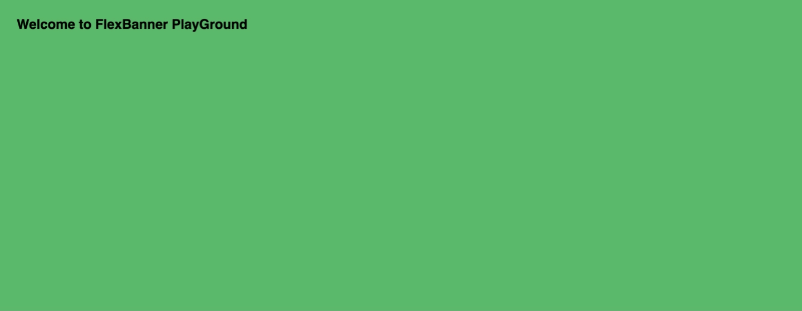
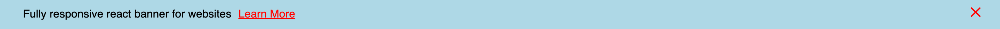
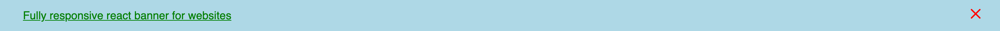
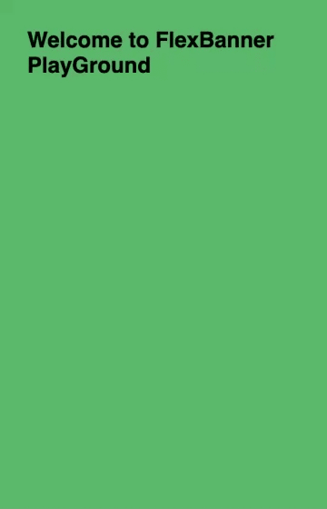

<div align="center">
  
</div>

<br />

<div align="center">
  Fully responsive react banner for websites. It is useful when you want to show important message to your website visitors such as product updates announcement, upcoming event announcement etc.
</div>

<br />

<div align="center">

[](https://www.npmjs.com/package/flex-banner) [](https://standardjs.com) [](https://travis-ci.com/IsAmrish/flex-banner)

</div>

<div align="center">
  <sub>A small react component `FlexBanner` to help you . Built with ❤︎ by
  <a href="https://github.com/isamrish">Amrish Kushwaha</a>
</div>

<br />

<p align="center">
  
</p>

## Install

```bash
npm install --save flex-banner
```

or

```bash
yarn add flex-banner
```

## Usage

```tsx
import * as React from "react";

import FlexBanner from "flex-banner";

class Example extends React.Component {
  render() {
    return (
      <FlexBanner
        title="Fully responsive react banner for websites"
        ctaLink="https://github.com/IsAmrish/flex-banner"
        ctaTitle="Learn More"
        isCenter={true}
      />
    );
  }
}
```

### Usage with Optional Properties

This example includes optional property in the component:

**ctaTitle** - Title of Call To Action (CTA).

**isCenter** - To make banner title and link center aligned.

**crossIconSize** - To define, font size of cross Icons.

**animationTime** - To define, sliding { SlideDown and SlideUp } time of banner.

**delayToShowBanner** - Delay in showing up banner.

**daysToLive** - No of days cookie will live before banner is shown up.

**wrapperStyle** - style object for styling of the wrapper

**mainStyleTitle** - style object for styling of the title of banner. If `ctaTitle` property is not defined, then this will defined the styling of link.

**mainStyleLink** - style object for styling of the CTA of banner.

**crossStyle** - style object for styling of the crossIcon. The font size of cross icon can only be defined by `crossIconSize` property.

**hidePermanentlyOnDate** - To hide banner permanently on a specific date / datetime

## Properties

| Property          | Type    | Required | Default value | Description                                                                                                                                                                                                             |
| ----------------- | ------- | -------- | ------------- | ----------------------------------------------------------------------------------------------------------------------------------------------------------------------------------------------------------------------- |
| title             | string  | yes      |               | the title of the banner                                                                                                                                                                                                 |
| ctaLink           | string  | yes      |               | url for the call to action                                                                                                                                                                                              |
| ctaTitle          | string  | no       |               | The title for call to action. It is not required if you want to use `title` as `title of call to action`                                                                                                                |
| isCenter          | boolean | no       | true          | Make center aligned the banner with value `true` otherwise left aligned using value `false`                                                                                                                             |
| crossIconSize     | number  | no       | 22            | size of crossIcon in px. Set its value to `0` if you don't want to add crossIcon.                                                                                                                                       |
| animationTime     | number  | no       | 1             | animationTime is in `seconds`. It's sliding time for banner. For no animation, set value to `0`.                                                                                                                        |
| delayToShowBanner | number  | no       | 2             | delayToShowBanner is in `seconds`. It's the time a user has to keep the page open before the banner is shown. For no delay, set value to `0`                                                                            |
| daysToLive        | number  | no       | 0             | A property specifying the `number of days` the cookie will live before the banner is shown again to a user. The default is `0`, it means that banner will show up every time user refresh the page or hit the page url. |
| wrapperStyle      | object  | no       |               | style object for styling of the wrapper                                                                                                                                                                                 |
| mainStyleTitle    | object  | no       |               | style object for styling of title                                                                                                                                                                                       |
| mainStyleLink     | object  | no       |               | style object for styling of Call To Action link                                                                                                                                                                         |
| crossStyle        | object  | no       |               | style object for styling cross Icon - such as color etc. **Note** - font size property will be set only by `crossIconSize` property.                                                                                    |

| hidePermanentlyOnDate        | Date  | no       |               | To hide banner permanently on a specific date / datetime property.                                                                                    |

### Example with CTA title

```tsx
import * as React from "react";

import FlexBanner from "flex-banner";

class Example extends React.Component {
  render() {
    return (
      <FlexBanner
        title="Fully responsive react banner for websites"
        ctaLink="https://github.com/IsAmrish/flex-banner"
        ctaTitle="Learn More"
        isCenter={false}
        crossIconSize={24}
        animationTime={1.5}
        delayToShowBanner={0}
        daysToLive={5}
        wrapperStyle={{ backgroundColor: "lightblue" }}
        mainStyleTitle={{ color: "black" }}
        mainStyleLink={{ color: "red" }}
        crossStyle={{ color: "red" }}
      />
    );
  }
}
```

#### Results

<p align="center">
  
</p>

### Example without CTA title

```tsx
import * as React from "react";

import FlexBanner from "flex-banner";

class Example extends React.Component {
  render() {
    return (
      <FlexBanner
        title="Fully responsive react banner for websites"
        ctaLink="https://github.com/IsAmrish/flex-banner"
        isCenter={false}
        crossIconSize={24}
        animationTime={1.5}
        delayToShowBanner={0}
        daysToLive={5}
        wrapperStyle={{ backgroundColor: "lightblue" }}
        mainStyleTitle={{ color: "green" }}
        mainStyleLink={{ color: "blue" }} // this will not work
        crossStyle={{ color: "red" }}
      />
    );
  }
}
```

#### Results

<p align="center">
  
</p>

---

## Responsive View of FlexBanner

The banner will be shown top regardless of screen.

<p align="center">
  
</p>

## License

MIT © [isamrish](https://github.com/isamrish)
